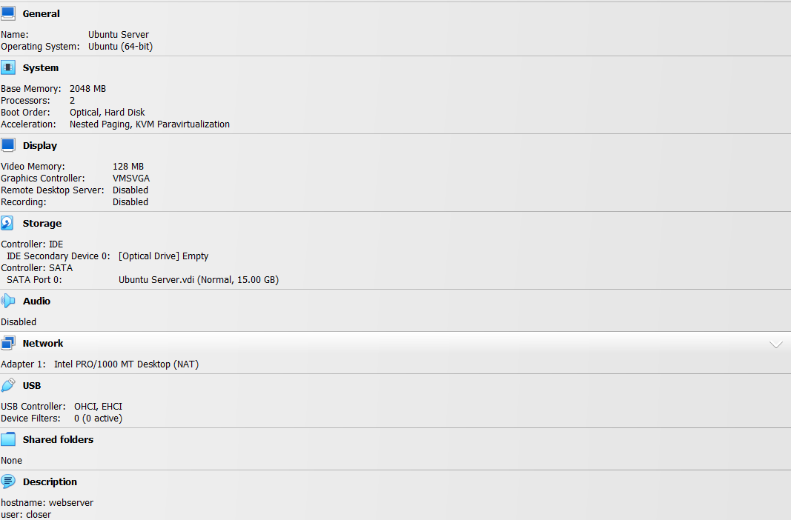
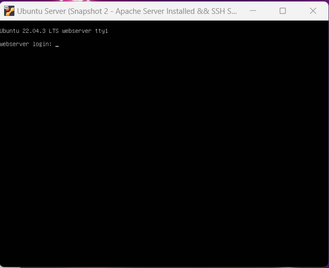
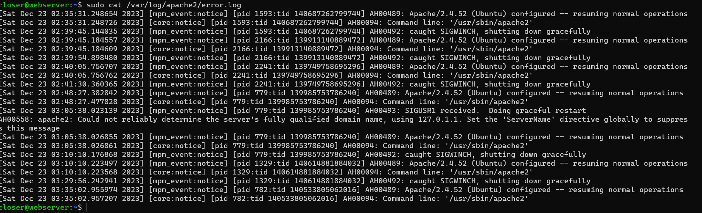

# Deliverable 2 - Installing Ubuntu Server and Apache

## What are the server hardware specifications?
 

## What is Ubuntu server log in screen?
 

## What is the IP address of your Ubuntu Server Virtual Machine?
* The ip address of my Ubuntu Server Virtual Machine is 127.0.0.1

## How do you enable the Ubuntu Firewall?
* you enable firewall with the command `sudo ufw enable`

## How do you check if the Ubuntu Firewall is running?
* you check if the Ubuntu Firewall is running with the command `sudo ufw status`

## How do you disable the Ubuntu Firewall?
* you disable firewall with the command `sudo ufw disable`

## How do you add Apache to the Firewall?
* you add Apache to the firewall with the command `sudo ufw allow 'Apache'`

## What is the command you used to install Apache?
* you install Apache with the command `sudo apt install apache2`

## What is the command you use to check if Apache is running?
* you check if Apache is running with the command `sudo systemctl status apache2 --no-pager`

## What is the command you use to stop Apache?
* you can stop Apache with the command `sudo systemctl stop apache2`

## What is the command you use to restart Apache?
* you can restart Apache with the command `sudo systemctl restart apache2`

## What is the command used to test Apache configuration?
* you can test the Apache configuration with the command `sudo apachectl -t`

## What is the command used to check the installed version of Apache?
* you can check the installed version of Apache with the command `sudo apache2 -v`

## What are the most common commands to troubleshoot Apache errors? Provide a brief description of each command.
* some of the most common commands to troubleshoot Apache errors are:
  * systemctl
    * interacts with the systemd manager, controls services
  * journalctl
    * used to view logs
  * apachectl
    * is used to check apache configurations

## Which are Apache Log Files, and what are they used for? Provide examples and screenshots.

* Apache log files are entries that contain information about apache processes. If there is an error, these logs will help in identifying the problem and implementing a solution.

