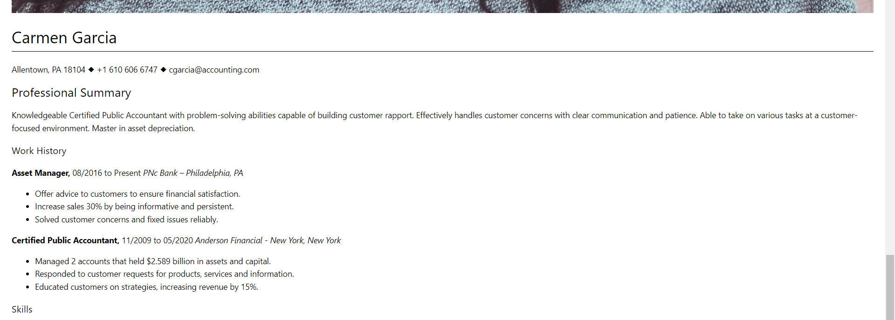

# Hosted a simple website

## My thoughts
* this became a bit tricky when I had to move the zip file to the Server.
* The scp command was not working, my connection kept getting denied.
* Despite my attempts at troubleshooting by allowing new ips through the firewall and restarting various processes, it did not work
* my solution was to clone my repository
  * `git clone https://fdelacruz02/cis106`
* I then removed all the directories except finalProject
* I moved into the finalProject directory
* I then moved the zip file "myresume.zip to the /usr/www/mywebsite/ directory
* I unzipped my file, deleted the index, changed my html file to index
* I finally went to my home directory and deleted the cis106 repository